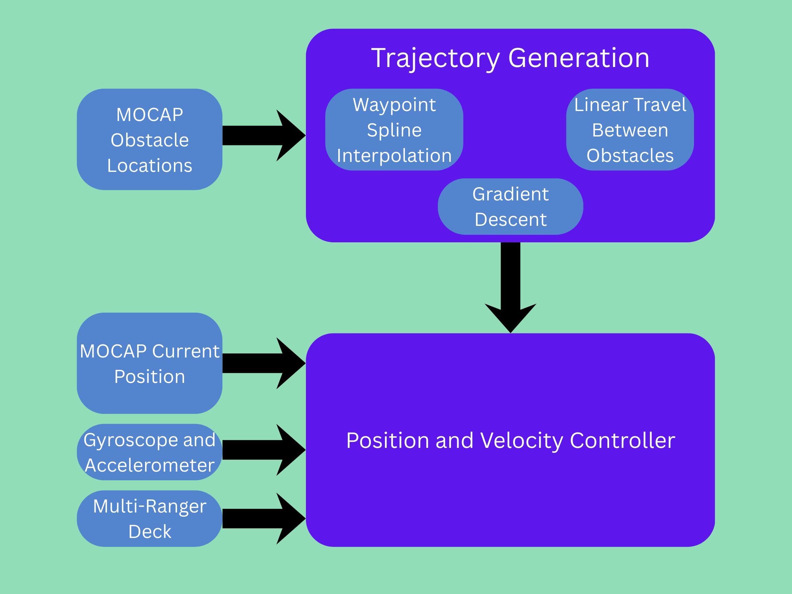

::: {.hero-section}


# Trajectory Planning and Velocity Optimization for Crazyflie 2.1 Quadrotor{.title}


::: {.subtitle}
Seeking safe, efficient, and fast drone navigation through an obstacle course.
:::


::: {.author-list}


[**Jesse Wei**](https://example.com)^1^,
[**Avyay Koorapaty**](https://example.com)^1^,
[**Neel Rajesh**](https://example.com)^1,^


:::


::: {.affiliation-list}


^1^University of Illinois Urbana-Champaign,  Department of Electrical and Computer Engineering


:::


::: {.button-row}


<!-- [[ Paper]{.btn-text}](https://arxiv.org/pdf/XXXX.XXXXX){.btn .btn-primary} -->
<!-- [[ arXiv]{.btn-text}](https://arxiv.org/abs/XXXX.XXXXX){.btn .btn-primary} -->
[[ Video]{.btn-text}](https://www.youtube.com/watch?v=cSQTZoZPJzs){.btn .btn-primary}
[[ Code]{.btn-text}](https://github.com/){.btn .btn-primary}
<!-- [[ Data]{.btn-text}](https://example.com){.btn .btn-primary} -->


:::


:::
<!-- ============================================================ -->
<!-- ABSTRACT -->
<!-- ============================================================ -->


::: {.section-container}


## Abstract {.section-title}


::: {.abstract-text}
We are building and testing various trajectory planning algorithms for a Crazyflie quadrotor that attempt to map the fastest path through an obstacle course. Through a state estimation framework utilizing measurements collected by sensors, the pose of the Crazyflie can be estimated. This trajectory and the estimated pose can be fed into a position and velocity controller that minimizes the amount of time it takes the quadrotor to complete the obstacle course. We are considering implementing different trajectory planning algorithms: linear fitting, polynomial fitting, and/or gradient descent with waypoints. We will consider implementing the speed controller using the Euclidean distance to the next obstacle and/or the curve of the trajectory, as well as incorporating sensor data. These algorithms will be developed and tested in simulation before being deployed to the hardware.
:::


:::


::: {.section-container}


## State Estimation Framework {.section-title}


:::


::: {.section-container}


## Trajectory Planning {.section-title}



:::


::: {.section-container}


## Architecture and Flow {.section-title}


:::

<!-- ============================================================ -->
<!-- OVERVIEW / METHOD VIDEO -->
<!-- ============================================================ -->


::: {.section-container}


## CrazySim Demo Video {.section-title}


::: {.content-text}
We have setup the simulator for Crazyflie with a video below showing a drone flying through square rings.
:::


::: {.video-container}
<!-- Replace with your YouTube or local video embed -->
<iframe
  data-external="1"
  src="https://drive.google.com/file/d/19gJNhy83WSmalq7L3kvWXCReEqtnhzXn/preview"
  width="640"
  height="480" >
</iframe>


:::


:::


::: {.section-container}


## Plan for Work Allocation {.section-title}


::: {.content-text}
One person will work developing the state estimator, another will work on the position and velocity controller, and another will work on developing and implementing the various trajectory planning algorithms.
:::

:::

<!-- ===Everything below here is from the template=== -->


<!-- ============================================================ -->
<!-- TEASER IMAGE / VIDEO -->
<!-- ============================================================ -->


<!-- ::: {.section-container} -->


<!-- ::: {.hero-teaser} -->


<!-- Option A: Use a static image as the teaser -->
<!-- {.teaser-img} -->


<!-- Option B: Embed a video teaser (uncomment below, comment out image above)

-->


<!-- ::: -->


<!-- ::: -->


<!-- ============================================================ -->
<!-- RESULTS GALLERY -->
<!-- ============================================================ -->


<!-- ::: {.section-container}


## Results {.section-title}


::: {.results-grid}


::: {.result-card}

:::


::: {.result-card}

:::


::: {.result-card}

:::


:::


::: -->


<!-- ============================================================ -->
<!-- QUALITATIVE COMPARISONS -->
<!-- ============================================================ -->


<!-- ::: {.section-container}


## Qualitative Comparisons {.section-title}


::: {.content-text}
Describe the comparison setup — which baselines are you comparing against, and
what should the reader look for in the side-by-side results.
:::


::: {.comparison-grid}


::: {.comparison-item}


**Ours**
:::


::: {.comparison-item}


**Baseline A**
:::


:::


::: -->


<!-- ============================================================ -->
<!-- INTERACTIVE SLIDER (Optional) -->
<!-- ============================================================ -->


<!-- ::: {.section-container}


## Interpolation Demo {.section-title}


::: {.content-text}
If your method supports interpolation or continuous control, you can add an
interactive slider here. The example below shows how to set one up.
:::


::: {.interpolation-panel}


::: {.interpolation-endpoints}
{.endpoint-img}


{.endpoint-img}
:::


<input type="range" min="0" max="100" value="50" class="interpolation-slider" id="interpolation-slider">
<div id="interpolation-value" class="interpolation-value">50%</div>


<script>
  const slider = document.getElementById('interpolation-slider');
  const display = document.getElementById('interpolation-value');
  slider.addEventListener('input', function() {
    display.textContent = this.value + '%';
  });
</script>


:::


::: -->


<!-- ============================================================ -->
<!-- RELATED WORK -->
<!-- ============================================================ -->


<!-- ::: {.section-container}


## Related Work {.section-title}


::: {.content-text}


Here are some related works in this area:


- [Related Paper 1](https://example.com) introduces an idea similar to ours for [topic].
- [Related Paper 2](https://example.com) also addresses [problem] using [approach].
- [Related Paper 3](https://example.com) proposes [technique] which is complementary to our method.


Check out [this survey](https://example.com) for a comprehensive overview of the field.
:::


::: -->


<!-- ============================================================ -->
<!-- BIBTEX -->
<!-- ============================================================ -->


::: {.section-container}


## BibTeX {.section-title}


```bibtex
@article{WhalesAcquringYummyMouthwateringOranges2026Project,
  author    = {Avyay Koorapaty and Jesse Wei and Neel Rajesh},
  title     = {Trajectory Planning and Optimization for Crazyflie 2.1 Quadrotor},
  journal   = {ECE 484},
  year      = {2026},
}
```


:::


<!-- ============================================================ -->
<!-- FOOTER -->
<!-- ============================================================ -->


::: {.site-footer}


This website template is adapted from the
[Nerfies](https://nerfies.github.io) project page, which is licensed under a
[Creative Commons Attribution-ShareAlike 4.0 International License](http://creativecommons.org/licenses/by-sa/4.0/).


:::


