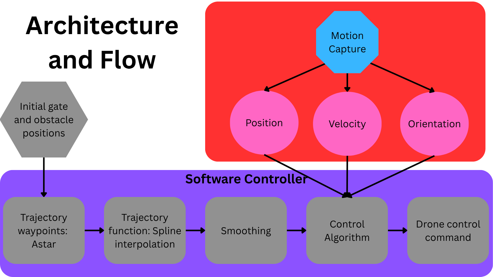
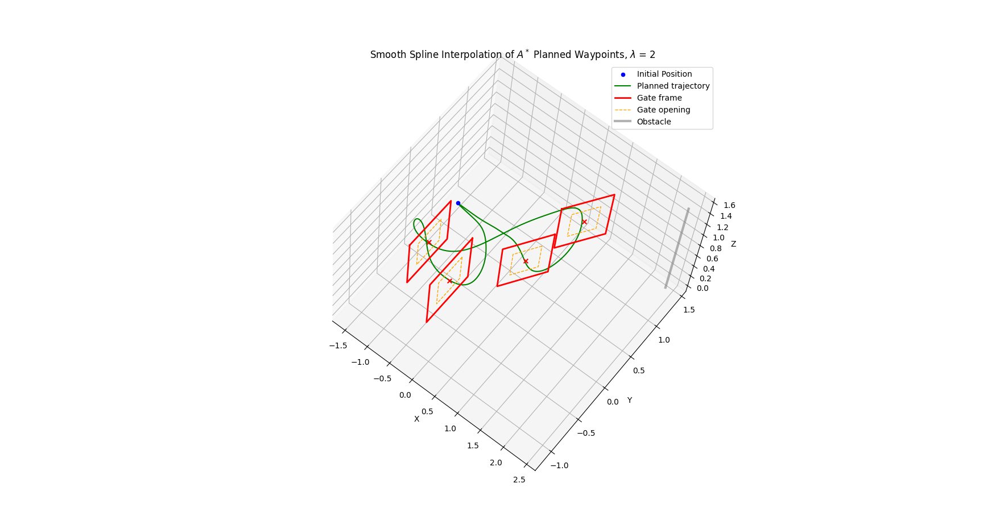
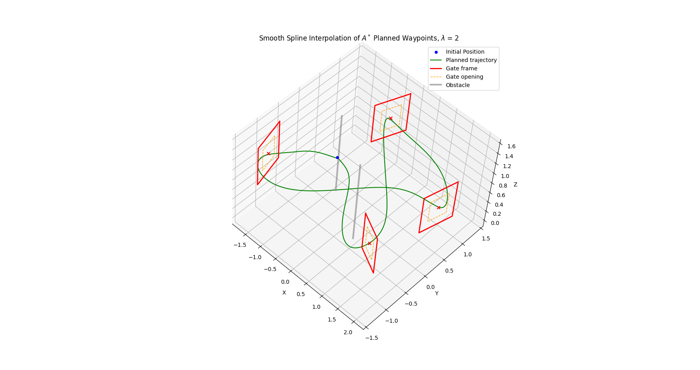
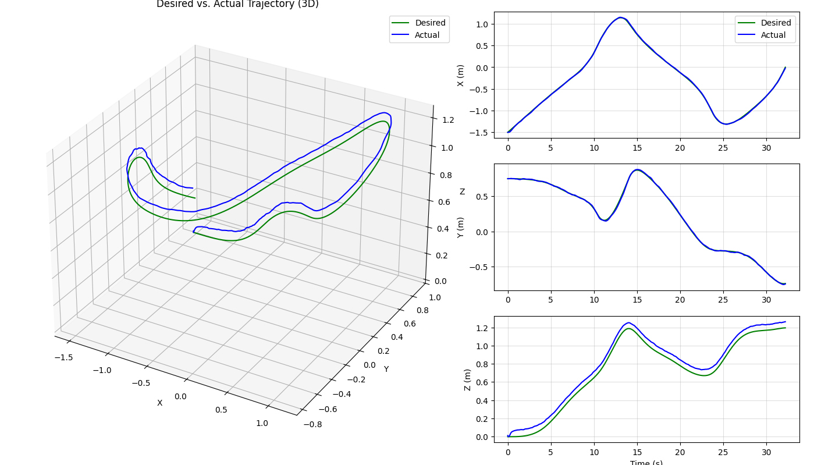
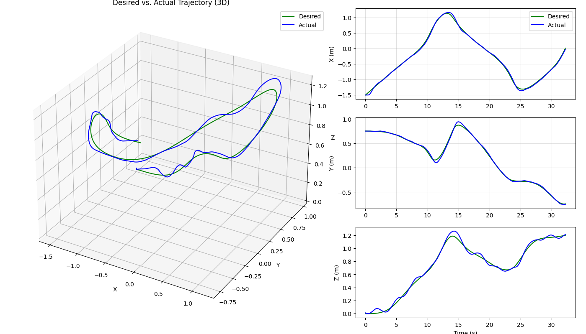
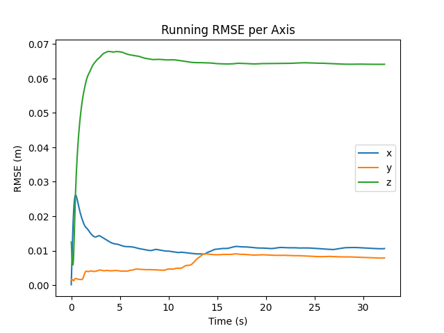
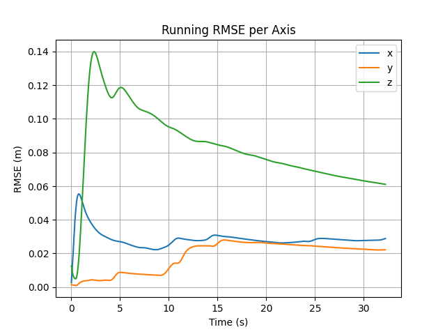

::: {.hero-section}


# Trajectory Planning and Control for Crazyflie 2.1 Quadrotor{.title}


::: {.subtitle}
Seeking safe, efficient, and fast drone navigation through an obstacle course.
:::


::: {.author-list}


[**Jesse Wei**](https://example.com)^1^,
[**Avyay Koorapaty**](https://example.com)^1^,
[**Neel Rajesh**](https://example.com)^1,^


:::


::: {.affiliation-list}


^1^University of Illinois Urbana-Champaign,  Department of Electrical and Computer Engineering


:::


::: {.button-row}


<!-- [[ Paper]{.btn-text}](https://arxiv.org/pdf/XXXX.XXXXX){.btn .btn-primary} -->
<!-- [[ arXiv]{.btn-text}](https://arxiv.org/abs/XXXX.XXXXX){.btn .btn-primary} -->
[[ Video]{.btn-text}](https://www.youtube.com/watch?v=cSQTZoZPJzs){.btn .btn-primary}
[[ Code]{.btn-text}](https://github.com/){.btn .btn-primary}
<!-- [[ Data]{.btn-text}](https://example.com){.btn .btn-primary} -->


:::


:::
<!-- ============================================================ -->
<!-- ABSTRACT -->
<!-- ============================================================ -->


::: {.section-container}


## Abstract {.section-title}


::: {.abstract-text}
We are building and testing various trajectory planning algorithms for a Crazyflie quadrotor that attempt to map the fastest path through an obstacle course. 
Through a state estimation framework utilizing measurements collected by sensors, the pose of the Crazyflie can be estimated. 
This trajectory and the estimated pose can be fed into a position and velocity controller that minimizes the amount of time it takes the quadrotor to complete the obstacle course. 
We are considering implementing different trajectory planning algorithms: linear fitting, polynomial fitting, and/or gradient descent with waypoints. 
We will consider implementing the speed controller using the Euclidean distance to the next obstacle and/or the curve of the trajectory, as well as incorporating sensor data. 
These algorithms will be developed and tested in simulation before being deployed to the hardware.
:::


:::


::: {.section-container}


## Architecture and Flow {.section-title}



::: {.content-text}
Below, we will introduce and discuss the various algorithms that make up this pipeline.
:::

:::

::: {.section-container}

<!-- ============================================================ -->
<!-- ASTAR -->
<!-- ============================================================ -->

## Path Planning: A$^*$ {.section-title}

::: {.content-text}
Given the positions and orientations of the gates and obstacles in the environment, we use A$^*$ search on a discretized 3D occupancy grid to produce a sequence of waypoints that guides the drone safely through every gate.
:::

### 3D Occupancy Grid

::: {.content-text}
The environment is discretized into a 3D grid with a resolution of $\Delta = 0.025$ m per cell. Every cell is initialized as free. Obstacle cylinders are inflated by a safety radius $r_{\text{obs}} = 0.3$ m and marked as occupied. Gate frame voxels are also marked as occupied, so the planner must route through the gate's normal axis rather than through its solid structure.
:::

### Gate Orientation and Normal Vector

::: {.content-text}
Each gate carries a pose described by a position $\mathbf{p}_g \in \mathbb{R}^3$ and roll-pitch-yaw angles. Only the yaw angle $\psi$ (rotation about the $z$-axis) matters for determining the direction through the gate. From $\psi$ we form the **gate normal vector**

$$
\hat{\mathbf{n}} = \begin{bmatrix} \cos\psi \\ \sin\psi \\ 0 \end{bmatrix}
$$

which points along the axis the drone must fly to pass cleanly through the gate opening.
:::

### Entry and Exit Waypoints

::: {.content-text}
To encourage the drone to approach each gate head-on, we place a pair of **approach waypoints** at a fixed standoff distance $d = 0.25$ m on either side of the gate center along the normal:

$$
\mathbf{w}_{\text{entry}} = \mathbf{p}_g - d\,\hat{\mathbf{n}}, \qquad \mathbf{w}_{\text{exit}} = \mathbf{p}_g + d\,\hat{\mathbf{n}}
$$

$\mathbf{w}_{\text{entry}}$ is the point the drone must reach before the gate, and $\mathbf{w}_{\text{exit}}$ is the point it must clear on the far side. These entry and exit waypoints are always added to the final waypoint list, which increased the probability of the drone successfully clearing each gate compared to when this was not in place.
:::

### Heuristic

::: {.content-text}
The A$^*$ heuristic is the standard **3D Euclidean distance** between a grid cell $\mathbf{a} = (a_x, a_y, a_z)$ and the segment goal $\mathbf{b} = (b_x, b_y, b_z)$:

$$
h(\mathbf{a}, \mathbf{b}) = \sqrt{(a_x - b_x)^2 + (a_y - b_y)^2 + (a_z - b_z)^2}
$$

Because the actual step cost between any two adjacent cells is also their Euclidean distance (see neighbor costs below), $h$ never overestimates the true cost-to-go, making it **admissible** and guaranteeing that A$^*$ finds an optimal path.
:::

### A$^*$ Search

::: {.content-text}
The search operates on grid indices rather than metric coordinates. Each cell has up to 26 neighbors. The movement cost of each step equals its Euclidean length:

$$
c(\delta x, \delta y, \delta z) = \sqrt{\delta x^2 + \delta y^2 + \delta z^2}
$$

so axis-aligned moves cost 1, face-diagonal moves cost $\sqrt{2}$, and body-diagonal moves cost $\sqrt{3}$.

The algorithm maintains a min-heap `open_set` of $(f, \mathbf{s})$ pairs ordered by the $f$-score

$$
f(\mathbf{s}) = g(\mathbf{s}) + h(\mathbf{s}, \mathbf{goal})
$$

where $g(\mathbf{s})$ is the best known cost from the start to cell $\mathbf{s}$. At each iteration the cell with the lowest $f$-score is expanded. For each free neighbor $\mathbf{n}$, a tentative cost $g' = g(\mathbf{s}) + c(\Delta)$ is computed; if $g' < g(\mathbf{n})$, the neighbor's cost and parent are updated and it is pushed onto the heap. The search terminates as soon as the goal cell is popped, at which point the path is reconstructed by following parent pointers back to the start.
:::

### Waypoint Assembly and Weights

::: {.content-text}
Rather than planning one long path from start to finish, we decompose the route into **per-segment problems**. For $K$ gates with entry–exit pairs $(\mathbf{w}_{\text{entry}}^k, \mathbf{w}_{\text{exit}}^k)$, the segments are

$$
(\mathbf{p}_{\text{start}},\; \mathbf{w}_{\text{entry}}^1),\quad (\mathbf{w}_{\text{exit}}^1,\; \mathbf{w}_{\text{entry}}^2),\quad \ldots,\quad (\mathbf{w}_{\text{exit}}^K,\; \mathbf{p}_{\text{end}})
$$

A$^*$ is run independently on each segment. The grid-index path returned by each run is converted back to metric coordinates via

$$
\mathbf{p}_{\text{world}} = \mathbf{p}_{\text{min}} + \mathbf{s} \cdot \Delta
$$

where $\mathbf{p}_{\text{min}} = [-2.5, -1.5, 0]^\top$ is the grid origin and $\mathbf{s}$ is the grid index triplet.

Each waypoint is assigned a scalar **weight** that will later influence the smoothing spline. Interior A$^*$ waypoints—those far from either endpoint of a segment—receive lower weights according to

$$
w_j = \frac{3}{1 + \min(j,\; n-1-j)}
$$

where $j$ is the waypoint's index in the path and $n$ is the total number of points in the segment. This down-weights mid-path points so the spline is free to shortcut through open space, while points near the segment endpoints are trusted more heavily. After each A$^*$ segment, three gate-critical waypoints are appended with fixed high weights:

| Waypoint | Weight |
|---|---|
| Gate entry approach $\mathbf{w}_{\text{entry}}^k$ | 15 |
| Gate center $\mathbf{p}_g^k$ | 5 |
| Gate exit approach $\mathbf{w}_{\text{exit}}^k$ | 15 |

The final output is a pair of arrays: an $(N \times 3)$ array of waypoint coordinates and an $(N,)$ array of weights. These are handed directly to the spline-smoothing stage.
:::

### Iterations and Key Design Decisions

::: {.content-text}
Our initial A$^*$ implementation had no explicit gate pass-through waypoints, which caused the drone's trajectory to clip the edge of gates rather than pass cleanly through the center. We fixed this by computing the entry and exit waypoints from the gate's normal vector and inserting them—along with the gate center—directly into the waypoint list. However, we then observed the drone treating some gates as free space—flying through their openings even when they weren't the target gate. Once the forced pass-through waypoints were in place, we simplified the grid by treating every gate as a fully solid obstacle, which eliminated that shortcutting behavior. We also discovered that the base of each gate post extends into the ground, so we adjusted the blocked cells to account for that region as well.
:::

:::

::: {.section-container}
<!-- ============================================================ -->
<!-- TRAJECTORY GENERATION -->
<!-- ============================================================ -->

## Trajectory Generation: Spline Interpolation and Smoothing {.section-title}

::: {.content-text}
We use scipy.interpolate.make_smoothing_spline to create a smooth interpolated trajectory through
the waypoints found from A$^*$. This function uses the following formula, found in [@scipy_smoothing_spline].

$$
\underbrace{\sum_{i=1}^n w_i \left\| y_i - f(x_i) \right\|^2}_{\text{data fidelity (weighted least squares)}}
\;+\;
\underbrace{\lambda \int_{x_1}^{x_n} \left( f^{(2)}(u) \right)^2 \, du}_{\text{smoothness penalty (curvature)}}
$$

We weight the two waypoints directly neighboring each gate very heavily. The weighting of the other waypoints goes
by section. Each section spans a stretch between two gates, between the start point and the first gate, or the last gate 
and the end point. For each section of waypoints, we weight the waypoints as a function of how far they are from the section's 
endpoints. For example, for the section between gate 1 and gate 2, the farther away in the sequence a waypoint is from either gate 1
or gate 2, the lower its weight.
:::




:::
<!-- ============================================================ -->
<!-- CONTROL -->
<!-- ============================================================ -->

## Control Policies: Position-Velocity-Acceleration and PID {.section-title}

### Position-Velocity-Acceleration Controller
::: {.content-text}
The aboslute position, velocity, and acceleration references from the trajectory are provided directly to the inner-loop flight controller.
The inner-loop flight controller then works to achieve these desired references.
:::

### PID Controller
::: {.content-text}
The PID controller outputs an attitude command that is fed to the inner-loop flight controller.
Based off of the error between the quadrotor's current position and the desired trajectory, an acceleration that minimizes this error is computed and converted into the desired attitude command. 
An error for each direction is computed as $e = (e_x, e_y, e_z) = (x_{desired} - x_{current}, y_{desired} - y_{current}, z_{desired} - z_{current})$.
The acceleration inputs are computed as follows based off
$$u_x = -K_{Px}*e - K_{Dx}*\frac{de}{dt} + K_{Ix}*\int_0^t e dt$$
$$u_y = -K_{Py}*e - K_{Dy}*\frac{de}{dt} + K_{Iy}*\int_0^t e dt$$
$$u_z = K_{Pz}*e + K_{Dz}*\frac{de}{dt} + K_{Iz}*\int_0^t e dt$$
with the corresponding PID gains for each direction.
The gains are as follows:

| Axis | Kp  | Kd  | Ki  |
|------|-----|-----|-----|
| X    | 18  | 7   | 0.2 |
| Y    | 18  | 7   | 0.2 |
| Z    | 10  | 1.5 | 1   |

The desired roll and pitch angles and thrust are computed as:
$$\phi_d = \tan^{-1}(\frac{u_y\cos(\theta)}{g - u_z})$$
$$\theta_d = \tan^{-1}(\frac{u_x}{u_z - g})$$
$$thrust = m*(u_z + g)$$
[@mathworks_quadrotor_ilc]
:::

::: {.section-container}

<!-- ============================================================ -->
<!-- METRICS/PLOTS -->
<!-- ============================================================ -->

## Performance Metrics and Plots {.section-title}


::: {.content-text}
We have tested multiple controllers in simulation and gathered performance metrics.

:::

### Desired vs. Actual Trajectory

::: {.content-text}
Position, Velocity, Acceleration Controller's Desired vs. Actual Trajectory:
:::



::: {.content-text}
PID Controller's Desired vs. Actual Trajectory:
:::



::: {.content-text}
Both of these simulation runs are on configuration level1.toml. 

The position, velocity, acceleration controller's x and y position 
closely follow the desired x and y position, even better than the PID controller.
The z position has a small close to constant offset from the desired z position throughout 
the run.

The PID controller's x and y position closely follow the desired x and y position.
The z position oscillates slightly around the desired z position throughout the run. 
:::

### Root Mean Squared Error Metric for Tracking Error

::: {.content-text}
Position, Velocity, Acceleration Controller's RMSE:
:::



::: {.content-text}
PID Controller's RMSE:
:::



::: {.content-text}
Both of these simulation runs, although not the exact same runs as for the 
trajectory tracking plots, are also on configuration level1.toml. 

The position, velocity, acceleration controller's x and y position errors are relatively 
low. The x error shoots up in the beginning and quickly flattens out.
The z position, as seen in the trajectory plot as well, 
has a constant error from the desired z position. 

The PID controller's x and y position errors follow similar shapes to that of the position, 
velocity, acceleration controller, although slightly higher. The z error has a different shape, 
shooting up in the beginning and then coming down into a smooth downward slope after a few oscillations. 
The z error also is higher than in the position, velocity, acceleration controller.
:::

#### Takeaways From the Trajectory and RMSE Plots

::: {.content-text}
From this tracking error data, it is clear we need to do some gain fine tuning to allow our PID 
controller to surpass the position, velocity, acceleration controller in performance.
:::

:::

<!-- ============================================================ -->
<!-- OVERVIEW / METHOD VIDEO -->
<!-- ============================================================ -->


::: {.section-container}


## Crazyflie Simulation and Hardware Videos {.section-title}

### Simulation of Position-Velocity-Acceleration Controller
::: {.video-container}
<!-- Replace with your YouTube or local video embed -->
<iframe src="https://drive.google.com/file/d/1Y3yMnmIy9ZMSvJoYKQyJ7HfLvOh8qcbF/preview" width="640" height="480"></iframe>
:::

### Simulation of PID Controller
::: {.video-container}
<!-- Replace with your YouTube or local video embed -->
<iframe src="https://drive.google.com/file/d/1W3QrOsuxsh2g_sG2H-VPxvTy9XZU4lEV/preview" width="640" height="480"></iframe>
:::

### Crazyflie Hardware Hover Demo
::: {.content-text}
We have performed the hardware setup to run our controllers on the Crazyflie drone. Below is a video of the drone hovering at a constant 0.4 meters off the ground.
:::

::: {.video-container}
<!-- Replace with your YouTube or local video embed -->
<iframe src="https://drive.google.com/file/d/1sl6MaTy3SprXmrG7_u4-0DvOkd0exGFI/preview" width="640" height="480"></iframe>
:::

:::

<!-- ============================================================ -->
<!-- Preliminary Testing on Varying Course Configurations -->
<!-- ============================================================ -->

::: {.section-container}

## Preliminary Testing on Varying Course Configurations {.section-title}
::: {.content-text}
| Course Configuration | Pos-Vel-Accel | PID     |
|----------------------|---------------|---------|
| Course 1             | 4 Gates       | 4 Gates |
| Course 2             | 1 Gate        | 1 Gate  |
| Course 3             | 3 Gates       | 4 Gates |
| Course 4             | 1 Gate        | 0 Gates |
| Course 5             | 0 Gates       | 0 Gates |
| Course 6             | 4 Gates       | 0 Gates |
The table above displays the number of gates passed through using the two different control policies for various course configurations.
The 4th gate is the final gate.

:::

:::

<!-- ============================================================ -->
<!-- Takeaways and Future Work -->
<!-- ============================================================ -->

::: {.section-container}

## Takeaways and Future Work {.section-title}

::: {.content-text}
The main takeaway from our results is to improve robustness of our controllers.
Both the position, velocity, acceleration controller and the PID controller have low average 
success rates when tested on a variety of different gate and obstacle configurations.

In addition, as stated earlier, in order to improve our PID controller to perform better than 
our position, velocity, acceleration controller, we need to do more fine tuning of gains. We will 
also need to adjust our gains to work with speed improvements that we implement in the future.

We will need to do some more investigation into causes of drone crashes in simulation, to better determine whether the path planned 
by A$^*$ or the controller's following of the path is at fault. It may be that in addition to improving our controllers, 
we can tune the constraints in our A$^*$ path planner to give more safety margin to keep the drone from crashing. 
We may also experiment with implementing an RRT path planner.

Furthermore, we plan to implement more controllers, perhaps Linear Quadratic Regulator or Model 
Predictive Control, and compare these to the two controllers we currently have.
:::

:::


<!-- ===Everything below here is from the template=== -->


<!-- ============================================================ -->
<!-- TEASER IMAGE / VIDEO -->
<!-- ============================================================ -->


<!-- ::: {.section-container} -->


<!-- ::: {.hero-teaser} -->


<!-- Option A: Use a static image as the teaser -->
<!-- {.teaser-img} -->


<!-- Option B: Embed a video teaser (uncomment below, comment out image above)

-->


<!-- ::: -->


<!-- ::: -->


<!-- ============================================================ -->
<!-- RESULTS GALLERY -->
<!-- ============================================================ -->


<!-- ::: {.section-container}


## Results {.section-title}


::: {.results-grid}


::: {.result-card}

:::


::: {.result-card}

:::


::: {.result-card}

:::


:::


::: -->


<!-- ============================================================ -->
<!-- QUALITATIVE COMPARISONS -->
<!-- ============================================================ -->


<!-- ::: {.section-container}


## Qualitative Comparisons {.section-title}


::: {.content-text}
Describe the comparison setup — which baselines are you comparing against, and
what should the reader look for in the side-by-side results.
:::


::: {.comparison-grid}


::: {.comparison-item}


**Ours**
:::


::: {.comparison-item}


**Baseline A**
:::


:::


::: -->


<!-- ============================================================ -->
<!-- INTERACTIVE SLIDER (Optional) -->
<!-- ============================================================ -->


<!-- ::: {.section-container}


## Interpolation Demo {.section-title}


::: {.content-text}
If your method supports interpolation or continuous control, you can add an
interactive slider here. The example below shows how to set one up.
:::


::: {.interpolation-panel}


::: {.interpolation-endpoints}
{.endpoint-img}


{.endpoint-img}
:::


<input type="range" min="0" max="100" value="50" class="interpolation-slider" id="interpolation-slider">
<div id="interpolation-value" class="interpolation-value">50%</div>


<script>
  const slider = document.getElementById('interpolation-slider');
  const display = document.getElementById('interpolation-value');
  slider.addEventListener('input', function() {
    display.textContent = this.value + '%';
  });
</script>


:::


::: -->


<!-- ============================================================ -->
<!-- RELATED WORK -->
<!-- ============================================================ -->


<!-- ::: {.section-container}


## Related Work {.section-title}


::: {.content-text}


Here are some related works in this area:


- [Related Paper 1](https://example.com) introduces an idea similar to ours for [topic].
- [Related Paper 2](https://example.com) also addresses [problem] using [approach].
- [Related Paper 3](https://example.com) proposes [technique] which is complementary to our method.


Check out [this survey](https://example.com) for a comprehensive overview of the field.
:::


::: -->


<!-- ============================================================ -->
<!-- BIBTEX -->
<!-- ============================================================ -->


::: {.section-container}


## BibTeX {.section-title}


```bibtex
@article{WhalesAcquringYummyMouthwateringOranges2026Project,
  author    = {Avyay Koorapaty and Jesse Wei and Neel Rajesh},
  title     = {Trajectory Planning and Optimization for Crazyflie 2.1 Quadrotor},
  journal   = {ECE 484},
  year      = {2026},
}
```


:::


<!-- ============================================================ -->
<!-- FOOTER -->
<!-- ============================================================ -->


::: {.site-footer}


This website template is adapted from the
[Nerfies](https://nerfies.github.io) project page, which is licensed under a
[Creative Commons Attribution-ShareAlike 4.0 International License](http://creativecommons.org/licenses/by-sa/4.0/).


:::


