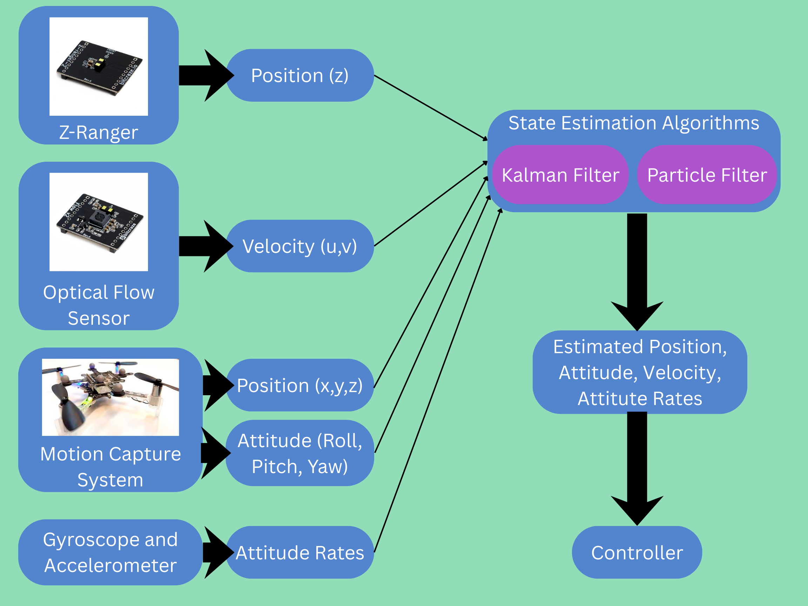

::: {.hero-section}

# Autonomous Crazyflie Racing {.title}

::: {.subtitle}
A catchy one-line description of your project
:::

::: {.author-list}

[**Jesse Wei**](https://example.com)^1^,
[**Avyay Koorapaty**](https://example.com)^2^,
[**Neel Rajesh**](https://example.com)^1,2^

:::

::: {.affiliation-list}

^1^University of Illinois Urbana-Champaign,  ^2^Research Lab / Company

:::

<!-- ::: {.button-row}

[[ Paper]{.btn-text}](https://arxiv.org/pdf/XXXX.XXXXX){.btn .btn-primary}
[[ arXiv]{.btn-text}](https://arxiv.org/abs/XXXX.XXXXX){.btn .btn-primary}
[[ Video]{.btn-text}](https://www.youtube.com/watch?v=cSQTZoZPJzs){.btn .btn-primary}
[[ Code]{.btn-text}](https://github.com/){.btn .btn-primary}
[[ Data]{.btn-text}](https://example.com){.btn .btn-primary}

::: -->

:::

::: {.section-container}

## Stability at Hover {.section-title}
<!--  -->

:::

::: {.section-container}

## State Estimation Framework {.section-title}


:::

::: {.section-container}

## Waypoint Tracking {.section-title}
<!--  -->

:::

<!-- ============================================================ -->
<!-- OVERVIEW / METHOD VIDEO -->
<!-- ============================================================ -->

::: {.section-container}

## CrazySim Demo Video {.section-title}

::: {.video-container}
<!-- Replace with your YouTube or local video embed -->
<iframe 
  data-external="1"
  src="https://drive.google.com/file/d/19gJNhy83WSmalq7L3kvWXCReEqtnhzXn/preview"
  width="640"
  height="480" >
</iframe>

:::

:::


<!-- ===Everything below here is from the template=== -->

<!-- ============================================================ -->
<!-- TEASER IMAGE / VIDEO -->
<!-- ============================================================ -->

<!-- ::: {.section-container} -->

<!-- ::: {.hero-teaser} -->

<!-- Option A: Use a static image as the teaser -->
<!-- {.teaser-img} -->

<!-- Option B: Embed a video teaser (uncomment below, comment out image above)

-->

<!-- ::: -->

<!-- ::: -->

<!-- ============================================================ -->
<!-- ABSTRACT -->
<!-- ============================================================ -->

<!-- ::: {.section-container}

## Abstract {.section-title}

::: {.abstract-text}
Replace this text with your project abstract. Describe the problem you are
solving, the key insight or contribution of your work, and the main results.
Keep it concise — typically 150–250 words. You can use **bold** and *italic*
formatting to emphasize key terms.

For example: We present a novel approach to [task] that achieves
state-of-the-art results on [benchmark]. Our method leverages [key technique]
to overcome [limitation of prior work]. Experiments demonstrate that our
approach outperforms existing methods by [metric improvement] while requiring
[efficiency gain].
:::

::: -->


<!-- ============================================================ -->
<!-- RESULTS GALLERY -->
<!-- ============================================================ -->

<!-- ::: {.section-container}

## Results {.section-title}

::: {.content-text}
Provide a brief description of the results shown below. Explain what the
reader should observe and why it matters.
:::

::: {.results-grid}

::: {.result-card}

:::

::: {.result-card}

:::

::: {.result-card}

:::

:::

::: -->


<!-- ============================================================ -->
<!-- QUALITATIVE COMPARISONS -->
<!-- ============================================================ -->

<!-- ::: {.section-container}

## Qualitative Comparisons {.section-title}

::: {.content-text}
Describe the comparison setup — which baselines are you comparing against, and
what should the reader look for in the side-by-side results.
:::

::: {.comparison-grid}

::: {.comparison-item}


**Ours**
:::

::: {.comparison-item}


**Baseline A**
:::

:::

::: -->


<!-- ============================================================ -->
<!-- INTERACTIVE SLIDER (Optional) -->
<!-- ============================================================ -->

<!-- ::: {.section-container}

## Interpolation Demo {.section-title}

::: {.content-text}
If your method supports interpolation or continuous control, you can add an
interactive slider here. The example below shows how to set one up.
:::

::: {.interpolation-panel}

::: {.interpolation-endpoints}
{.endpoint-img}

{.endpoint-img}
:::

<input type="range" min="0" max="100" value="50" class="interpolation-slider" id="interpolation-slider">
<div id="interpolation-value" class="interpolation-value">50%</div>

<script>
  const slider = document.getElementById('interpolation-slider');
  const display = document.getElementById('interpolation-value');
  slider.addEventListener('input', function() {
    display.textContent = this.value + '%';
  });
</script>

:::

::: -->


<!-- ============================================================ -->
<!-- RELATED WORK -->
<!-- ============================================================ -->

<!-- ::: {.section-container}

## Related Work {.section-title}

::: {.content-text}

Here are some related works in this area:

- [Related Paper 1](https://example.com) introduces an idea similar to ours for [topic].
- [Related Paper 2](https://example.com) also addresses [problem] using [approach].
- [Related Paper 3](https://example.com) proposes [technique] which is complementary to our method.

Check out [this survey](https://example.com) for a comprehensive overview of the field.
:::

::: -->


<!-- ============================================================ -->
<!-- BIBTEX -->
<!-- ============================================================ -->

<!-- ::: {.section-container}

## BibTeX {.section-title}

```bibtex
@article{yourname2026project,
  author    = {Author One and Author Two and Author Three},
  title     = {Your Project Title Here},
  journal   = {Conference or Journal Name},
  year      = {2026},
}
```

::: -->


<!-- ============================================================ -->
<!-- FOOTER -->
<!-- ============================================================ -->

::: {.site-footer}

This website template is adapted from the
[Nerfies](https://nerfies.github.io) project page, which is licensed under a
[Creative Commons Attribution-ShareAlike 4.0 International License](http://creativecommons.org/licenses/by-sa/4.0/).

:::
